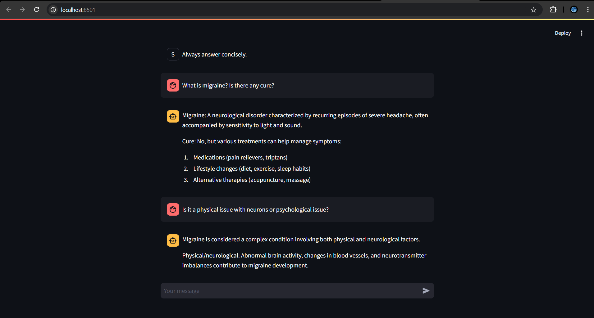

# conversational_ai

## basic_streamlit
A direct interface to already pre-trained model.  
Used:
1. [LM-Studio](https://lmstudio.ai/): Windows application for hosting models locally
   1. Model used: `QuantFactory/Meta-Llama-3-8B-Instruct-GGUF` `Q3_K_M`
2. [streamlit](https://streamlit.io/): for UI

Basic UI:

Reference:
- [IBM Technology](https://www.youtube.com/@IBMTechnology) video [Build a Large Language Model AI Chatbot using Retrieval Augmented Generation](https://www.youtube.com/watch?v=XctooiH0moI)

----

## basic_streamlit_II
Added:
- Strteaming assistant response

----

## RAG_QA
Question-Answering with RAG on a given document, using locally hosted model in Ollama.  
Used:
1. [Ollama](https://ollama.com/): For hosting `llamar3.1` model locally.
2. [Docarray](https://docs.docarray.org/user_guide/storing/docindex/): As vectorstore.
3. [streamlit](https://streamlit.io/): for UI
  
References:
- [Underfitted](https://www.youtube.com/@underfitted) video [Building a RAG application using open-source models (Asking questions from a PDF using Llama2)](https://www.youtube.com/watch?v=HRvyei7vFSM)

----

## RAG_QA_II

Added on top of RAG_QA:
- Persistent vector store.

Additionaly used:
1. [ChromaDB](https://python.langchain.com/v0.2/docs/integrations/vectorstores/chroma/): For persistent vector storage

----
